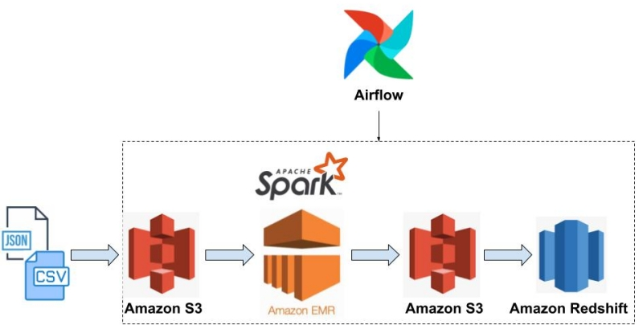

# DEND - Capstone Project

Jun Zhu
___

Describe your project at a high level.

Explain what you plan to do in the project in more detail. What data do you use? What is your end solution look like? What tools did you use? etc>

Clearly state the rationale for the choice of tools and technologies for the project.



## Datasets

### Captial Bikeshare trip data

[Capital Bikeshare](https://www.capitalbikeshare.com/) is a metro DC's 
bikeshare service in the US, with thousands of bikes and hundreds of stations 
across 7 jurisdictions: Washington, DC.; Arlington, VA; Alexandria, VA; 
Montgomery, MD; Prince George's County, MD; Fairfax County, VA; and the City 
of Falls Church, VA. Designed for quick trips with convenience in mind, 
it’s a fun and affordable way to get around.

In order to answer questions like where do riders go? When do they ride? How
far do they go? Which stations are most popular? What days of the week are
most rides taken on? Capital Bikeshare provides all the 
[trip data](https://s3.amazonaws.com/capitalbikeshare-data/index.html) in **CSV**
format that allow to answer those questions.

#### Covid data

The [COVID Tracking project](https://covidtracking.com/) collects, 
cross-checks, and publishes COVID-19 data from 56 US states and territories 
in three main areas: testing, hospitalization, and patient outcomes, 
racial and ethnic demographic information via The COVID Racial Data Tracker, 
and long-term-care facilities via the Long-Term-Care tracker.

The capstone project uses `Historic values for all states` **JSON** data 
downloaded from the [data API](https://covidtracking.com/data/api). 
Descriptions of the data fields can also be found there.

#### Weather data

The weather data is from [NOAA](https://www.ncdc.noaa.gov/cdo-web/). I ordered
daily observation data since 1.1.2018 from more than 100 weather stations in 
Washington DC. The data is in **CSV** format. 

## Explore and Assess the Data

Details can be found in the Jupyter notebook 
[workspace/data_exploration.ipynb](workspace/data_exploration.ipynb).

#### Setting up a Spark cluster locally (optional)

Check the Docker Compose file [here](../dev_envs/spark_docker). Remeber to change
the `WORKSPACE` in the [env](../dev_envs/spark_docker/.env) file to the `workspace`
in the current directory.

## Define the Data Model


## Run ETL Pipeline to Model the Data

#### Start an EMR cluster

#### Run Apache Airflow in Docker

Copy the [Docker Compose file](../dev_envs/airflow_docker/docker-compose.yaml)
into the `airflow` directory and start Airflow server by
```sh
cd airflow
docker-compose up
```

#### Trigger the data pipeline

- Integrity constraints on the relational database (e.g., unique key, data type, etc.)
- Unit tests for the scripts to ensure they are doing the right thing
- Source/Count checks to ensure completeness

*Propose how often the data should be updated and why.*

## Scalability of the data pipeline

- What if the data was increased by 100x? 
- What if the data populates a dashboard that must be updated on a daily basis 
  by 7am every day?
- What if the database needed to be accessed by 100+ people?